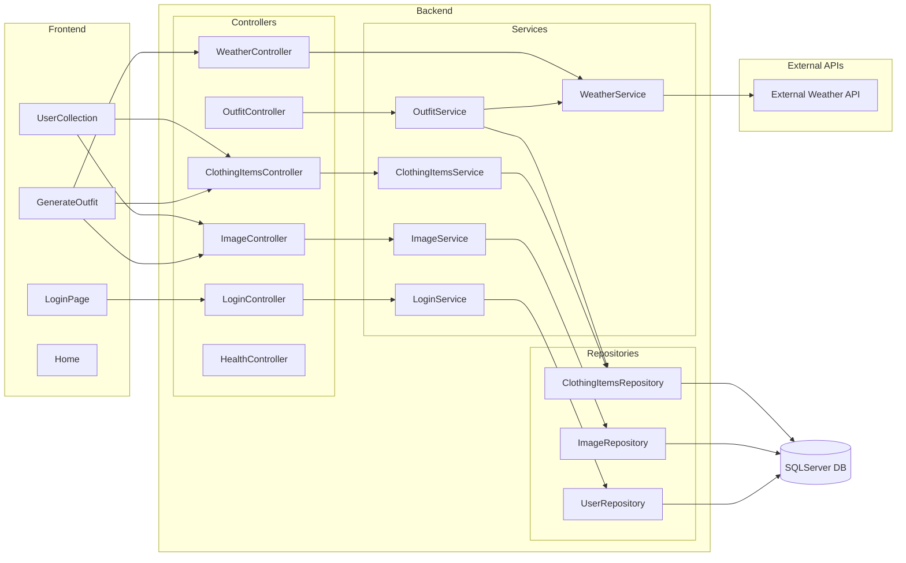

# Trendify: a full-stack wardrobe app written in Blazor and C# (ASP.NET Core)

## Overview

Trendify allows the user to:
- **Upload items of clothing** from their own wardrobe with an image and description
- **Receive outfit recommendations** for a given location, based on the current weather at that location
- **Display all the items** in their wardrobe
- **Filter the items in their wardrobe** according to various categories (e.g. size, brand etc.)

## Application structure

The repository is divided into the following projects:
- [Backend](tree/main/WardrobeWebApp/Backend) 
- [Backend.Tests](tree/main/WardrobeWebApp/Backend.Tests)
- [FrontEnd](tree/main/WardrobeWebApp/FrontEnd/FrontEnd)

The overall structure can be visualised in the following chart:

## Acknowledgements
Trendify was produced as a group project assignment for a [Northcoders](https://northcoders.com/) C# bootcamp.

## Dependencies

- The frontend project uses [Tailwind](https://github.com/tailwindlabs/tailwindcss) for CSS processing, licensed under [MIT](https://github.com/tailwindlabs/tailwindcss?tab=MIT-1-ov-file#readme)